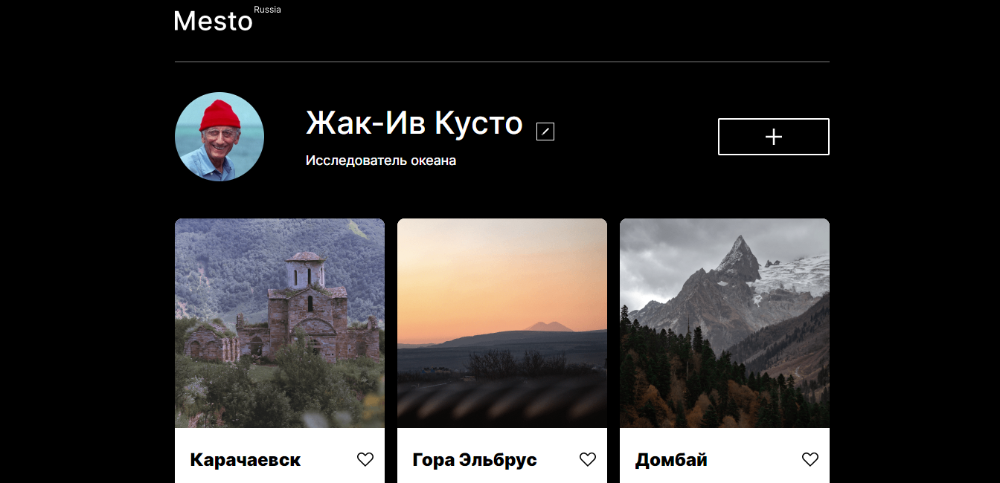

# Проект: Интерактивный сервис Mesto

### Обзор
* Описание
* Применяемые технологии
* GitHub Pages

**Описание**

Данный проект представляет собой интерактивную страницу, куда можно добавлять карточки с фотографиями, удалять их и ставить лайки, а также редактировать свой профиль, плюс реализована возможность предпросмотра изображений. 

**Применяемые технологии**

1. Работа выполнена в соответствии с методологией БЭМ.
2. Для создания сеток используются flexbox и grid.
3. В проекте реализована адаптивная верстка.
4. Для возможности редактирования профиля, добавления карточек и предпросмотра фотографий применяются диалоговые окна ("попап").
5. Логика написана на JavaScript.

**GitHub Pages**

Мой проект на [GitHub Pages](https://tatyanakarpova.github.io/mesto/).
